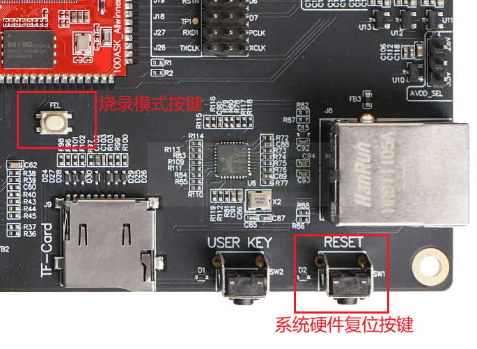

# 100ASK_T113_Pro开发板上手体验

## 开发板硬件简述（简单开箱视频） 

### 核心板资源介绍

100ASK-T113_Pro开发板是基于全志T113-S3芯片设计，最大化的复用了引脚IO，并重新适用社区版Buildroot适配了系统，做到高可移植性以及简单轻量化。开发板形态：我们的这款开发板分为核心板与底板组合的形式发布，可以单独购买核心板，主要用于量产，核心板讲所有主芯片未使用到的引脚引出，很方便去扩展底板功能等。


 如上图所示，核心板内包含T113-S3主芯片,电源电路，以及板载Flash。同时也可以看到下图T113-S3芯片的规格与详细配置，T113-S3 是一款专为汽车和工业控制设计的高级应用处理器市场。 它集成了双核 CortexTM-A7 CPU 和单核 HiFi4 DSP 以提供高效的计算能力。 T113-S3 支持全格式解码，例如 H.265、H.264、MPEG-1/2/4、JPEG、VC1 等。 独立的硬件编码器可以编码为 JPEG 或MJPEG。 集成的多 ADC/DAC 和 I2S/PCM/DMIC/OWA 音频接口可以提供完善的语音交互解决方案。 T113-S3 具有广泛的连接性，以方便产品扩展，如USB、SDIO、EMAC、TWI、UART、SPI、PWM、GPADC、IR TX&RX等。更详细的规格参数可以查看 `t113-s3_brief.pdf`


###  全功能底板资源介绍

配套的全功能底板，也叫做Pro开发板，功能非常丰富，有网口，WiFi蓝牙，TF卡接口，OTG接口，串口，USB接口，DVP摄像头接口，音频录音接口，音频输出接口，USB PCI-E 4G接口，以及RGB888显示等接口使用。我们将芯片所有的IO引脚 全都引出，可以最大程度去评估学习使用这款芯片，不管是用于产品预研评估，还是学习入门嵌入式Linux开发，这款板子都非常适合。


| 序号 | 板载资源                                                | 序号 | 板载资源                                                     |
| ---- | ------------------------------------------------------- | ---- | ------------------------------------------------------------ |
| 1    | RESET复位按键，主要用于复位系统使用。                   | 17   | LINE接口,用于音频阵列输入                                    |
| 2    | 用户按键，可自定义功能。                                | 18   | RGB LCD接口，用于驱动显示RGB屏幕。                           |
| 3    | TF卡卡槽，用于读取TF卡并支TF卡启动系统。                | 19   | E-INK水墨屏接口，用于驱动类SPI水墨屏。                       |
| 4    | XR829无线模组配套的ANT天线接受-.                        | 20   | DVP摄像头电压选择                                            |
| 5    | Debug接口,用于串口输出，显示系统信息,调试登录等。       | 21   | DVP摄像头专用接口.                                           |
| 6    | OTG接口，主要用于烧写SPI-NAND系统使用,也可用于ADB调试。 | 22   | DVP摄像头电压选择                                            |
| 7    | 电源供电切换开关，用于切换供电方式是OTG口还是DC电源口。 | 23   | DVP摄像头电压选择                                            |
| 8    | DC接口，用于接入专用电源适配器给开发板独立供电。        | 24   | RJ45网线接口，用于连接有线网络                               |
| 9    | eSIM卡接口，手机卡接口，用于4G模块拨号上网使用。        | 25   | RESET复位按键，主要用于复位系统使用。                        |
| 10   | TYPE-AUSB2.0接口，用于连接常见USB设备。                 | 26   | 网卡与摄像头功能选择排针，根据排针连接方向选择合适的复用方式。 |
| 11   | TYPE-AUSB2.0接口，用于连接常见USB设备。                 | 27   | RTL8201F网卡PHY芯片，用于有线上网。                          |
| 12   | TYPE-AUSB2.0接口，用于连接常见USB设备。                 | 28   | SPI-NAND FLASH,用于存储系统,系统支持SPI NAND启动。           |
| 13   | TV IN/OUT接口，用于连接老式AV电视机输出。               | 29   | XR829模组,用于wiFi Bluetooth无线通信支持。                   |
| 14   | 多余排针信号引出有一路 2C信号及4路ADC信号。             | 30   | USB HUB芯片，用于扩展多路USB接口。                           |
| 15   | 3.5MM耳机接口，用于播放声音                             | 31   | USB串口芯片，用于支持TL转USB信号输出。                       |
| 16   | MIC咪头，专用于用于录音.                                | 32   | USB PCI-E接口，专用于4G模组连接使用。                        |

## 上电启动 登录系统

###  使用串口

#### 1.连接串口线

如下图所示，我们需要先使用配套的12V DC电源适配器连接左侧蓝框内`DC供电接口`，此时开发板的红色接口位置 拨动开关拨到左侧，可以给开发板用来供电，供电成功后，核心板上的绿色灯会亮起，此时我们使用一根TypeC线连接至下图右下角所示 蓝框 `Debug接口`将TypeC线一端连接至 板子，另一端连接至电脑 USB2.0接口。


#### 2.安装串口驱动程序

连接成功串口type-c 数据线后，Windows会自动安装驱动(安装可能比较慢，等一分钟左右)。

此时可以打开电脑的**设备管理器**，在**端口(COM和LPT)**项下，可以看到下图的(**COM13**)端口号。开发板上的USB串口芯片可能是CP210x或CH9102，它们的性能是一样的。你电脑上显示的COM序号可能不一样，记住你电脑显示的数字。


如果电脑没有显示出端口号，就需要手动安装驱动，从驱动精灵官网（[www.drivergenius.com](http://www.drivergenius.com)）下载一个驱动精灵，安装、运行、检测，会自动安装上串口驱动。

#### 3.运行串口工具

串口工具有很多种，这里我们推荐使用Putty或者MobaXterm等串口工具来登录开发板。

* putty工具可以访问页面 https://www.chiark.greenend.org.uk/~sgtatham/putty/ 来获取。

* MobaXterm可以通过访问页面 https://mobaxterm.mobatek.net/ 获取 (推荐使用)。

**使用putty登录串口**

如下图所示，打开软件主界面参考下图红框序号所示，依次 **点击1** 切换到 Serial(串行设备) 界面，之后点击**红框2**输入上一步骤在电脑设备管理器内获取到的 端口号，在后面的**红框 Speed**波特率速率里面输入 `115200`,基本配置完成后，需要切换配置一下 流控设置，点击软件 左侧 蓝框内 **Serial**按钮，切换到 串行设备配置界面，切换成功后，参考下图**红框3** 选择`Flow control `流控项为`None`，最后点击**红框4** Open即可打开开发板对应的串口设备，此时 可以按下 键盘 enter回车 按键  输入 ls 看到系统的目录信息。


**使用Mobaxterm登录串口**

打开MobaXterm，点击左上角的`Session`，在弹出的界面选中`Serial`，如下图所示选择端口号（前面设备管理器显示的端口号COM13）、波特率（Speed 115200）、流控（Flow Control: none）,最后点击`OK`即可。步骤如下图所示。 **注意：流控（Flow Control）一定要选择none，否则你将无法在MobaXterm中向串口输入数据**

[](https://cdn.staticaly.com/gh/DongshanPI/Docs-Photos@master/DongshanNezhaSTU/Mobaxterm_serial_set_001.png)

随后显示一个黑色的窗口， 此时打开板子的电源开关，将收到板子串口发过来的数据,如下步骤所示


#### 4.进入shell

看到上述图片显示的信息后，按下键盘上的 enter 键 即可进入 T113 开发板Linux系统的Shell交互界面。


### 使用adb

#### 1.连接OTG线

​	将开发板配套的两根typec线，一根 直接连接至 开发板 下图红框所示 OTG 位置， 另一头连接至电脑的USB接口，开发板的 拨动开关拨至**右侧** (往OTG口方向),因OTG也可以给整个板子供电，所以此时可以不用接12V DC接口， 系统就会自己启动。


等待10秒左右，此时你的电脑设备管理器会在 `Android Phone`下多出一项 `Android ADB Interface`设备，这个设备就是T113开发板通过OTG接口模拟出来的 ADB设备，可以通过它来进行登录系统，传输文件等操作。


**注意：如果没有出现可能是电脑默认没有相关驱动，请使用驱动精灵等工具自动安装。**


#### 2.安装windows板ADB

既然有了ADB设备，那么我们需要在Windows下安装adb工具才可以和T113-PRo开发板交互，点击链接 https://gitlab.com/dongshanpi/tools/-/raw/main/ADB.7z 下载Windows版ADB工具下载完成后解压，可以看到如下目录。

[](https://cdn.staticaly.com/gh/DongshanPI/Docs-Photos@master/d1s/adb-tools-dir.png)

然后 我们单独 拷贝 上一层的 **platform-tools** 文件夹到任意 目录，拷贝完成后，记住这个 目录位置，我们接下来要把这个 路径添加至 Windows系统环境变量里。

[](https://cdn.staticaly.com/gh/DongshanPI/Docs-Photos@master/d1s/adb-tools-dir-001.png)

我这里是把它单独拷贝到了 D盘，我的目录是 `D:\platform-tools` 接下来 我需要把它单独添加到Windows系统环境变量里面才可以在任意位置使用adb命令。

[](https://cdn.staticaly.com/gh/DongshanPI/Docs-Photos@master/d1s/adb-tools-windows_config_001.png)

添加到 Windows系统环境变量里面 [](https://cdn.staticaly.com/gh/DongshanPI/Docs-Photos@master/d1s/adb-tools-windows_config_002.png)

#### 3.打开cmd连接开发板

打开CMD Windows 命令提示符方式有两种
方式1：直接在Windows10/11搜索对话框中输入 cmd 在弹出的软件中点击 `命令提示符`
方式2：同时按下 wind + r 键，输入 cmd 命令，按下确认 就可以自动打开 `命令提示符`

[](https://cdn.staticaly.com/gh/DongshanPI/Docs-Photos@master/d1s/adb-tools-windows_config_003.png)

打开命令提示符，输出 adb命令可以直接看到我们的adb已经配置成功

[](https://cdn.staticaly.com/gh/DongshanPI/Docs-Photos@master/d1s/adb-tools-windows_config_004.png)

连接好开发板的 OTG 并将其连接至电脑上，然后 输入 adb shell就可以自动登录系统


#### 4.adb登录

如下所示，在Windows 终端内输入 adb shell即可自动登录进入开发板系统内。


ADB 也可以作为文件传输使用，例如：

```
C:\System> adb push badapple.mp4 /mnt/UDISK   # 将 badapple.mp4 上传到开发板 /mnt/UDISK 目录内
C:\System> adb pull /mnt/UDISK/badapple.mp4   # 将 /mnt/UDISK/badapple.mp4 下拉到当前目录内
```

**注意： 此方法目前只适用于 使用全志Tina-SDK 构建出来的系统。**


## 根据启动log 简要分析系统启动顺序

​	如下图所示，左侧虚线框表示 实际的嵌入式设备启动顺序步骤，右侧实线框表示常见的 Linux系统启动顺序，都是从上往下依次执行。


如下logs为 T113 NAND启动信息，可以进行阅读分析。

``` shell
[28]HELLO! BOOT0 is starting!
[31]BOOT0 commit : 88480af-dirty
[34]set pll start
[36]fix vccio detect value:0xc0
[43]periph0 has been enabled
[46]set pll end
[48][pmu]: bus read error
[50]board init ok
[52]ZQ value = 0x30
[54]get_pmu_exist() = -1
[57]DRAM BOOT DRIVE INFO: V0.33
[60]DRAM CLK = 936 MHz
[62]DRAM Type = 3 (2:DDR2,3:DDR3)
[65]DRAMC read ODT  off.
[67]DRAM ODT value: 0x42.
[70]ddr_efuse_type: 0xa
[73]DRAM SIZE =128 M
[75]dram_tpr4:0x0
[77]PLL_DDR_CTRL_REG:0xf8004d00
[80]DRAM_CLK_REG:0xc0000000
[82][TIMING DEBUG] MR2= 0x20
[90]DRAM simple test OK.
[92]rtc standby flag is 0x0, super standby flag is 0x0
[97]dram size =128
[100]spinand UBOOT_START_BLK_NUM 8 UBOOT_LAST_BLK_NUM 32
[105]block from 8 to 32
[204]Check is correct.
[206]dma 0x29c0c int is not used yet
[210]dma 0x29c0c int is free, you do not need to free it again
[215]Entry_name        = u-boot
[221]Entry_name        = optee
[225]Entry_name        = dtb
[228]Jump to second Boot.
M/TC: OP-TEE version: 6aef7bb2-dirty (gcc version 5.3.1 20160412 (Linaro GCC 5.3-2016.05)) #1 Fri Jul 23 09:25:11 UTC 2021 arm


U-Boot 2018.05-g24521d6-dirty (Feb 07 2023 - 01:44:41 -0500) Allwinner Technology

[00.281]CPU:   Allwinner Family
[00.284]Model: sun8iw20
I2C:   FDT ERROR:fdt_set_all_pin:[twi0]-->FDT_ERR_BADPATH
FDT ERROR:fdt_set_all_pin:[twi1]-->FDT_ERR_BADPATH
ready
[00.306]DRAM:  128 MiB
[00.309]Relocation Offset is: 04f01000
[00.328]secure enable bit: 0
[00.331]smc_tee_inform_fdt failed with: -65526[00.335]CPU=1008 MHz,PLL6=600 Mhz,AHB=200 Mhz, APB1=100Mhz  MBus=300Mhz
[00.342]gic: sec monitor mode
[00.345]flash init start
[00.347]workmode = 0,storage type = 0
sspi->base_addr = 0x4025000, the SPI control register:
[VER] 0x4025000 = 0x00010001, [GCR] 0x4025004 = 0x00000083, [TCR] 0x4025008 = 0x00000184
[ICR] 0x4025010 = 0x00000f00, [ISR] 0x4025014 = 0x00000032, [FCR] 0x4025018 = 0x00200020
[FSR] 0x402501c = 0x00000000, [WCR] 0x4025020 = 0x00000000, [CCR] 0x4025024 = 0x00000002
[SDC] 0x4025028 = 0x00002000, [BCR] 0x4025030 = 0x00000000, [TCR] 0x4025034 = 0x00000000
[BCC] 0x4025038 = 0x10000000, [DMA] 0x4025088 = 0x000000e5

[00.393]sunxi-spinand-phy: not detect any munufacture from id table
[00.400]sunxi-spinand-phy: get spi-nand Model from fdt fail
[00.405]sunxi-spinand-phy: get phy info from fdt fail

device nand0 <nand>, # parts = 4
 #: name                size            offset          mask_flags
 0: boot0               0x00100000      0x00000000      1
 1: uboot               0x00300000      0x00100000      1
 2: secure_storage      0x00100000      0x00400000      1
 3: sys                 0x07b00000      0x00500000      0

active partition: nand0,0 - (boot0) 0x00100000 @ 0x00000000

defaults:
mtdids  : nand0=nand
mtdparts: mtdparts=nand:1024k@0(boot0)ro,3072k@1048576(uboot)ro,1024k@4194304(secure_storage)ro,-(sys)
[00.564]ubi0: attaching mtd4
[00.776]ubi0: scanning is finished
[00.785]ubi0: attached mtd4 (name "sys", size 123 MiB)
[00.790]ubi0: PEB size: 262144 bytes (256 KiB), LEB size: 258048 bytes
[00.796]ubi0: min./max. I/O unit sizes: 4096/4096, sub-page size 2048
[00.802]ubi0: VID header offset: 2048 (aligned 2048), data offset: 4096
[00.808]ubi0: good PEBs: 492, bad PEBs: 0, corrupted PEBs: 0
[00.814]ubi0: user volume: 9, internal volumes: 1, max. volumes count: 128
[00.820]ubi0: max/mean erase counter: 2/1, WL threshold: 4096, image sequence number: 0
[00.828]ubi0: available PEBs: 0, total reserved PEBs: 492, PEBs reserved for bad PEB handling: 20
[00.837]sunxi flash init ok
[01.032]Loading Environment from SUNXI_FLASH... OK
[01.068]Item0 (Map) magic is bad
secure storage read widevine fail
[01.074]secure storage read widevine fail with:-1
secure storage read ec_key fail
[01.081]secure storage read ec_key fail with:-1
secure storage read ec_cert1 fail
[01.088]secure storage read ec_cert1 fail with:-1
secure storage read ec_cert2 fail
[01.096]secure storage read ec_cert2 fail with:-1
secure storage read ec_cert3 fail
[01.103]secure storage read ec_cert3 fail with:-1
secure storage read rsa_key fail
[01.111]secure storage read rsa_key fail with:-1
secure storage read rsa_cert1 fail
[01.118]secure storage read rsa_cert1 fail with:-1
secure storage read rsa_cert2 fail
[01.126]secure storage read rsa_cert2 fail with:-1
secure storage read rsa_cert3 fail
[01.133]secure storage read rsa_cert3 fail with:-1
[01.138]usb burn from boot
delay time 0
weak:otg_phy_config
[01.149]usb prepare ok
[01.313]usb sof ok
[01.315]usb probe ok
[01.317]usb setup ok
set address 0x15
set address 0x15 ok
set address 0x16
set address 0x16 ok
try to update
[04.322]do_burn_from_boot usb : have no handshake
[04.348]update bootcmd
[04.371]change working_fdt 0x43ec0e70 to 0x43ea0e70
[04.389]update dts
Hit any key to stop autoboot:  0
[05.820]no vendor_boot partition is found
Android's image name: t113-100ask
[05.831]Starting kernel ...

[    0.000000] Booting Linux on physical CPU 0x0
[    0.000000] Linux version 5.4.61 (book@ubuntu1804) (arm-openwrt-linux-muslgnueabi-gcc.bin (OpenWrt/Linaro GCC 6.4-2017.11 2017-11) 6.4.1, GNU ld (GNU Binutils) 2.27) #24 SMP PREEMPT Tue Feb 7 08:23:51 UTC 2023
[    0.000000] CPU: ARMv7 Processor [410fc075] revision 5 (ARMv7), cr=10c5387d
[    0.000000] CPU: div instructions available: patching division code
[    0.000000] CPU: PIPT / VIPT nonaliasing data cache, VIPT aliasing instruction cache
[    0.000000] OF: fdt: Machine model: sun8iw20
[    0.000000] printk: bootconsole [earlycon0] enabled
[    0.000000] Memory policy: Data cache writealloc
[    0.000000] cma: Reserved 8 MiB at 0x47800000
[    0.000000] On node 0 totalpages: 32768
[    0.000000]   Normal zone: 256 pages used for memmap
[    0.000000]   Normal zone: 0 pages reserved
[    0.000000]   Normal zone: 32768 pages, LIFO batch:7
[    0.000000] psci: probing for conduit method from DT.
[    0.000000] psci: PSCIv1.0 detected in firmware.
[    0.000000] psci: Using standard PSCI v0.2 function IDs
[    0.000000] psci: MIGRATE_INFO_TYPE not supported.
[    0.000000] psci: SMC Calling Convention v1.0
[    0.000000] percpu: Embedded 15 pages/cpu s30348 r8192 d22900 u61440
[    0.000000] pcpu-alloc: s30348 r8192 d22900 u61440 alloc=15*4096
[    0.000000] pcpu-alloc: [0] 0 [0] 1
[    0.000000] Built 1 zonelists, mobility grouping on.  Total pages: 32512
[    0.000000] Kernel command line: ubi.mtd=sys ubi.block=0,rootfs earlyprintk=sunxi-uart,0x02500C00 clk_ignore_unused initcall_debug=0 console=ttyS3,115200 loglevel=8 root=/dev/ubiblock0_5 rootfstype=squashfs init=/pseudo_init partitions=mbr@ubi0_0:boot-resource@ubi0_1:env@ubi0_2:env-redund@ubi0_3:boot@ubi0_4:rootfs@ubi0_5:private@ubi0_6:rootfs_data@ubi0_7:UDISK@ubi0_8: cma=8M snum= mac_addr= wifi_mac= bt_mac= specialstr= gpt=1 androidboot.hardware=sun8iw20p1 boot_type=5 androidboot.boot_type=5 gpt=1 uboot_message=2018.05-g24521d6-dirty(02/07/2023-01:44:41) aw-ubi-spinand.ubootblks=24 androidboot.dramsize=128
[    0.000000] Dentry cache hash table entries: 16384 (order: 4, 65536 bytes, linear)
[    0.000000] Inode-cache hash table entries: 8192 (order: 3, 32768 bytes, linear)
[    0.000000] mem auto-init: stack:off, heap alloc:off, heap free:off
[    0.000000] Memory: 108612K/131072K available (6144K kernel code, 264K rwdata, 1504K rodata, 1024K init, 1164K bss, 14268K reserved, 8192K cma-reserved)
[    0.000000] SLUB: HWalign=64, Order=0-3, MinObjects=0, CPUs=2, Nodes=1
[    0.000000] rcu: Preemptible hierarchical RCU implementation.
[    0.000000]  Tasks RCU enabled.
[    0.000000] rcu: RCU calculated value of scheduler-enlistment delay is 10 jiffies.
[    0.000000] NR_IRQS: 16, nr_irqs: 16, preallocated irqs: 16
[    0.000000] random: get_random_bytes called from start_kernel+0x264/0x3e8 with crng_init=0
[    0.000000] arch_timer: cp15 timer(s) running at 24.00MHz (phys).
[    0.000000] clocksource: arch_sys_counter: mask: 0xffffffffffffff max_cycles: 0x588fe9dc0, max_idle_ns: 440795202592 ns
[    0.000005] sched_clock: 56 bits at 24MHz, resolution 41ns, wraps every 4398046511097ns
[    0.008016] Switching to timer-based delay loop, resolution 41ns
[    0.014183] clocksource: timer: mask: 0xffffffff max_cycles: 0xffffffff, max_idle_ns: 79635851949 ns
[    0.023888] Calibrating delay loop (skipped), value calculated using timer frequency.. 48.00 BogoMIPS (lpj=240000)
[    0.034245] pid_max: default: 32768 minimum: 301
[    0.038969] Mount-cache hash table entries: 1024 (order: 0, 4096 bytes, linear)
[    0.046284] Mountpoint-cache hash table entries: 1024 (order: 0, 4096 bytes, linear)
[    0.054614] CPU: Testing write buffer coherency: ok
[    0.059806] /cpus/cpu@0 missing clock-frequency property
[    0.065122] /cpus/cpu@1 missing clock-frequency property
[    0.070461] CPU0: thread -1, cpu 0, socket 0, mpidr 80000000
[    0.076623] Setting up static identity map for 0x40100000 - 0x40100060
[    0.083267] rcu: Hierarchical SRCU implementation.
[    0.088459] smp: Bringing up secondary CPUs ...
[    0.094084] CPU1: thread -1, cpu 1, socket 0, mpidr 80000001
[    0.094202] smp: Brought up 1 node, 2 CPUs
[    0.104014] SMP: Total of 2 processors activated (96.00 BogoMIPS).
[    0.110184] CPU: All CPU(s) started in SVC mode.
[    0.115251] devtmpfs: initialized
[    0.129527] VFP support v0.3: implementor 41 architecture 2 part 30 variant 7 rev 5
[    0.137645] clocksource: jiffies: mask: 0xffffffff max_cycles: 0xffffffff, max_idle_ns: 19112604462750000 ns
[    0.147501] futex hash table entries: 512 (order: 3, 32768 bytes, linear)
[    0.154721] pinctrl core: initialized pinctrl subsystem
[    0.160889] NET: Registered protocol family 16
[    0.166764] DMA: preallocated 256 KiB pool for atomic coherent allocations
[    0.202246] rtc_ccu: sunxi ccu init OK
[    0.208113] ccu: sunxi ccu init OK
[    0.211842] r_ccu: sunxi ccu init OK
[    0.236361] iommu: Default domain type: Translated
[    0.241419] sunxi iommu: irq = 24
[    0.245590] SCSI subsystem initialized
[    0.249566] usbcore: registered new interface driver usbfs
[    0.255145] usbcore: registered new interface driver hub
[    0.260536] usbcore: registered new device driver usb
[    0.266582] Advanced Linux Sound Architecture Driver Initialized.
[    0.273192] Bluetooth: Core ver 2.22
[    0.276857] NET: Registered protocol family 31
[    0.281294] Bluetooth: HCI device and connection manager initialized
[    0.287677] Bluetooth: HCI socket layer initialized
[    0.292567] Bluetooth: L2CAP socket layer initialized
[    0.297641] Bluetooth: SCO socket layer initialized
[    0.302784] pwm module init!
[    0.306801] g2d 5410000.g2d: Adding to iommu group 0
[    0.312087] G2D: rcq version initialized.major:252
[    0.317683] clocksource: Switched to clocksource arch_sys_counter
[    0.332152] sun8iw20-pinctrl 2000000.pinctrl: initialized sunXi PIO driver
[    0.341409] NET: Registered protocol family 2
[    0.346314] tcp_listen_portaddr_hash hash table entries: 512 (order: 0, 6144 bytes, linear)
[    0.354744] TCP established hash table entries: 1024 (order: 0, 4096 bytes, linear)
[    0.362432] TCP bind hash table entries: 1024 (order: 1, 8192 bytes, linear)
[    0.369502] TCP: Hash tables configured (established 1024 bind 1024)
[    0.375948] UDP hash table entries: 256 (order: 1, 8192 bytes, linear)
[    0.382527] UDP-Lite hash table entries: 256 (order: 1, 8192 bytes, linear)
[    0.389716] NET: Registered protocol family 1
[    0.394997] sun8iw20-pinctrl 2000000.pinctrl: 2000000.pinctrl supply vcc-pc not found, using dummy regulator
[    0.405268] spi spi0: spi0 supply spi not found, using dummy regulator
[    0.411971] sunxi_spi_resource_get()2151 - [spi0] SPI MASTER MODE
[    0.418109] sunxi_spi_resource_get()2189 - Failed to get sample mode
[    0.424453] sunxi_spi_resource_get()2194 - Failed to get sample delay
[    0.430916] sunxi_spi_resource_get()2198 - sample_mode:-1431633921 sample_delay:-1431633921
[    0.439332] sunxi_spi_clk_init()2240 - [spi0] mclk 100000000
[    0.445540] sunxi_spi_probe()2653 - [spi0]: driver probe succeed, base c881f000, irq 42
[    0.455107] workingset: timestamp_bits=30 max_order=15 bucket_order=0
[    0.465684] squashfs: version 4.0 (2009/01/31) Phillip Lougher
[    0.471714] ntfs: driver 2.1.32 [Flags: R/W].
[    0.504485] io scheduler mq-deadline registered
[    0.509057] io scheduler kyber registered
[    0.514283] [DISP]disp_module_init
[    0.518166] disp 5000000.disp: Adding to iommu group 0
[    0.534858] disp 5000000.disp: 5000000.disp supply vcc-lcd not found, using dummy regulator
[    0.543457] disp 5000000.disp: 5000000.disp supply vcc-pd not found, using dummy regulator
[    0.557041] display_fb_request,fb_id:0
[    0.564376] [DISP] Fb_copy_boot_fb,line:1443:
[    0.564380] no boot_fb0
[    0.571614] disp_al_manager_apply ouput_type:0
[    0.576367] [DISP] lcd_clk_config,line:732:
[    0.576378] disp 0, clk: pll(306000000),clk(306000000),dclk(51000000) dsi_rate(306000000)
[    0.576378]      clk real:pll(300000000),clk(300000000),dclk(50000000) dsi_rate(0)
[    0.578010] [DISP]disp_module_init finish
[    0.581490] sun8iw20-pinctrl 2000000.pinctrl: 2000000.pinctrl supply vcc-pd not found, using dummy regulator
[    0.597298] sunxi_sid_init()551 - insmod ok
[    0.615445] sun8iw20-pinctrl 2000000.pinctrl: 2000000.pinctrl supply vcc-pg not found, using dummy regulator
[    0.625578] uart uart1: get regulator failed
[    0.629889] uart uart1: uart1 supply uart not found, using dummy regulator
[    0.636985] uart1: ttyS1 at MMIO 0x2500400 (irq = 34, base_baud = 1500000) is a SUNXI
[    0.645349] sun8iw20-pinctrl 2000000.pinctrl: 2000000.pinctrl supply vcc-pb not found, using dummy regulator
[    0.655495] uart uart3: get regulator failed
[    0.659818] uart uart3: uart3 supply uart not found, using dummy regulator
[    0.666922] uart3: ttyS3 at MMIO 0x2500c00 (irq = 35, base_baud = 1500000) is a SUNXI
[    0.674788] sw_console_setup()1808 - console setup baud 115200 parity n bits 8, flow n
▒[    0.682762] printk: console [ttyS3] enabled
[    0.682762] printk: console [ttyS3] enabled
[    0.691685] printk: bootconsole [earlycon0] disabled
[    0.691685] printk: bootconsole [earlycon0] disabled
[    0.703037] misc dump reg init
[    0.707350] sunxi-rfkill soc@3000000:rfkill@0: module version: v1.0.9
[    0.714641] sunxi-rfkill soc@3000000:rfkill@0: get gpio chip_en failed
[    0.722010] sunxi-rfkill soc@3000000:rfkill@0: get gpio power_en failed
[    0.729451] sunxi-rfkill soc@3000000:rfkill@0: wlan_busnum (1)
[    0.736001] sunxi-rfkill soc@3000000:rfkill@0: Missing wlan_power.
[    0.742958] sunxi-rfkill soc@3000000:rfkill@0: wlan clock[0] (32k-fanout1)
[    0.750724] sunxi-rfkill soc@3000000:rfkill@0: wlan_regon gpio=204 assert=1
[    0.758588] sunxi-rfkill soc@3000000:rfkill@0: wlan_hostwake gpio=202 assert=1
[    0.766713] sunxi-rfkill soc@3000000:rfkill@0: wakeup source is enabled
[    0.774357] sunxi-rfkill soc@3000000:rfkill@0: Missing bt_power.
[    0.781133] sunxi-rfkill soc@3000000:rfkill@0: bt clock[0] (32k-fanout1)
[    0.788684] sunxi-rfkill soc@3000000:rfkill@0: bt_rst gpio=207 assert=0
[    0.796832] dma-buf: Running sanitycheck
[    0.801278] dma-buf: Running dma_fence
[    0.805480] sizeof(dma_fence)=48
[    0.807872] [DISP] disp_device_attached_and_enable,line:233:
[    0.807876] attached ok, mgr0<-->dev0
[    0.809254] dma-buf: Running dma_fence/sanitycheck
[    0.815439] [DISP] disp_device_attached_and_enable,line:236:
[    0.815447] type:1,mode:0,fmt:rgb,bits:8bits,eotf:4,cs:0 dvi_hdmi:2, range:2 scan:0 ratio:8
[    0.819582] dma-buf: Running dma_fence/test_signaling
[    0.846372] dma-buf: Running dma_fence/test_add_callback
[    0.852358] dma-buf: Running dma_fence/test_late_add_callback
[    0.858816] dma-buf: Running dma_fence/test_rm_callback
[    0.864676] dma-buf: Running dma_fence/test_late_rm_callback
[    0.871040] dma-buf: Running dma_fence/test_status
[    0.876412] dma-buf: Running dma_fence/test_error
[    0.881697] dma-buf: Running dma_fence/test_wait
[    0.886883] dma-buf: Running dma_fence/test_wait_timeout
[    0.927696] dma-buf: Running dma_fence/test_stub
[    0.932893] dma-buf: Running dma_fence/race_signal_callback
[    1.007707] thread_signal_callback[0] completed 38002 passes, 8184 misses
[    1.015355] thread_signal_callback[1] completed 38013 passes, 8196 misses
[    1.097723] thread_signal_callback[0] completed 45977 passes, 45975 misses
[    1.105463] thread_signal_callback[1] completed 45914 passes, 45913 misses
[    1.113689] sunxi-spinand: AW SPINand MTD Layer Version: 2.0 20201228
[    1.120977] sunxi-spinand-phy: AW SPINand Phy Layer Version: 1.10 20200306
[    1.128976] sunxi-spinand-phy: not detect any munufacture from id table
[    1.136398] sunxi-spinand-phy: get spi-nand Model from fdt fail
[    1.143065] sunxi-spinand-phy: get phy info from fdt fail
[    1.149129] sunxi-spinand-phy: not detect munufacture from fdt
[    1.155832] sunxi-spinand-phy: detect munufacture from id table: Mxic
[    1.163080] sunxi-spinand-phy: detect spinand id: ffff12c2 ffffffff
[    1.170167] sunxi-spinand-phy: ========== arch info ==========
[    1.176709] sunxi-spinand-phy: Model:               MX35LF1GE4AB
[    1.183480] sunxi-spinand-phy: Munufacture:         Mxic
[    1.189453] sunxi-spinand-phy: DieCntPerChip:       1
[    1.195115] sunxi-spinand-phy: BlkCntPerDie:        1024
[    1.201079] sunxi-spinand-phy: PageCntPerBlk:       64
[    1.206837] sunxi-spinand-phy: SectCntPerPage:      4
[    1.212513] sunxi-spinand-phy: OobSizePerPage:      64
[    1.218281] sunxi-spinand-phy: BadBlockFlag:        0x1
[    1.224137] sunxi-spinand-phy: OperationOpt:        0x7
[    1.230004] sunxi-spinand-phy: MaxEraseTimes:       65000
[    1.236055] sunxi-spinand-phy: EccFlag:             0x2
[    1.241919] sunxi-spinand-phy: EccType:             4
[    1.247580] sunxi-spinand-phy: EccProtectedType:    3
[    1.253251] sunxi-spinand-phy: ========================================
[    1.260674] sunxi-spinand-phy:
[    1.264191] sunxi-spinand-phy: ========== physical info ==========
[    1.271129] sunxi-spinand-phy: TotalSize:    128 M
[    1.276499] sunxi-spinand-phy: SectorSize:   512 B
[    1.281876] sunxi-spinand-phy: PageSize:     2 K
[    1.287050] sunxi-spinand-phy: BlockSize:    128 K
[    1.292428] sunxi-spinand-phy: OOBSize:      64 B
[    1.297708] sunxi-spinand-phy: ========================================
[    1.305123] sunxi-spinand-phy:
[    1.308662] sunxi-spinand-phy: ========== logical info ==========
[    1.315493] sunxi-spinand-phy: TotalSize:    128 M
[    1.320873] sunxi-spinand-phy: SectorSize:   512 B
[    1.326242] sunxi-spinand-phy: PageSize:     4 K
[    1.331425] sunxi-spinand-phy: BlockSize:    256 K
[    1.336794] sunxi-spinand-phy: OOBSize:      128 B
[    1.342172] sunxi-spinand-phy: ========================================
[    1.349740] sunxi-spinand-phy: block lock register: 0x00
[    1.355880] sunxi-spinand-phy: feature register: 0x11
[    1.361563] sunxi-spinand-phy: sunxi physic nand init end
[    1.368077] Creating 4 MTD partitions on "sunxi_mtd_nand":
[    1.374238] 0x000000000000-0x000000100000 : "boot0"
[    1.388600] 0x000000100000-0x000000400000 : "uboot"
[    1.396652] random: fast init done
[    1.418556] 0x000000400000-0x000000500000 : "secure_storage"
[    1.438540] 0x000000500000-0x000008000000 : "sys"
[    1.803398] random: crng init done
[    1.838985] libphy: Fixed MDIO Bus: probed
[    1.844405] sun8iw20-pinctrl 2000000.pinctrl: 2000000.pinctrl supply vcc-pe not found, using dummy regulator
[    1.855717] sunxi gmac driver's version: 1.0.0
[    1.860885] gmac-power0: NULL
[    1.864212] gmac-power1: NULL
[    1.867536] gmac-power2: NULL
[    1.871949] Failed to alloc md5
[    1.875480] eth0: Use random mac address
[    1.880160] ehci_hcd: USB 2.0 'Enhanced' Host Controller (EHCI) Driver
[    1.887485] sunxi-ehci: EHCI SUNXI driver
[    1.892322] ohci_hcd: USB 1.1 'Open' Host Controller (OHCI) Driver
[    1.899295] sunxi-ohci: OHCI SUNXI driver
[    1.904216] i2c /dev entries driver
[    1.908234] sunxi cedar version 1.1
[    1.912299] sunxi-cedar 1c0e000.ve: Adding to iommu group 0
[    1.918608] VE: sunxi_cedar_probe power-domain init!!!
[    1.924375] VE: install start!!!
[    1.924375]
[    1.929883] VE: cedar-ve the get irq is 43
[    1.929883]
[    1.936309] VE: ve_debug_proc_info:0ad696bb, data:1468d683, lock:1ff02c62
[    1.936309]
[    1.945605] VE: install end!!!
[    1.945605]
[    1.950693] VE: sunxi_cedar_probe
[    1.954644] Bluetooth: HCI UART driver ver 2.3
[    1.959654] Bluetooth: HCI UART protocol H4 registered
[    1.965415] Bluetooth: HCI UART protocol BCSP registered
[    1.971401] Bluetooth: XRadio Bluetooth LPM Mode Driver Ver 1.0.10
[    1.978592] [XR_BT_LPM] bluesleep_probe: bt_wake polarity: 1
[    1.984983] [XR_BT_LPM] bluesleep_probe: host_wake polarity: 1
[    1.991554] [XR_BT_LPM] bluesleep_probe: wakeup source is disabled!
[    1.991554]
[    2.000251] [XR_BT_LPM] bluesleep_probe: uart_index(1)
[    2.008061] sunxi-mmc 4020000.sdmmc: SD/MMC/SDIO Host Controller Driver(v4.21 2021-11-18 10:02)
[    2.018026] sunxi-mmc 4020000.sdmmc: ***ctl-spec-caps*** 8
[    2.024219] sunxi-mmc 4020000.sdmmc: No vmmc regulator found
[    2.030584] sunxi-mmc 4020000.sdmmc: No vqmmc regulator found
[    2.037029] sunxi-mmc 4020000.sdmmc: No vdmmc regulator found
[    2.043482] sunxi-mmc 4020000.sdmmc: No vd33sw regulator found
[    2.050032] sunxi-mmc 4020000.sdmmc: No vd18sw regulator found
[    2.056574] sunxi-mmc 4020000.sdmmc: No vq33sw regulator found
[    2.063124] sunxi-mmc 4020000.sdmmc: No vq18sw regulator found
[    2.070079] sunxi-mmc 4020000.sdmmc: Got CD GPIO
[    2.075477] sunxi-mmc 4020000.sdmmc: set cd-gpios as 24M fail
[    2.082139] sunxi-mmc 4020000.sdmmc: sdc set ios:clk 0Hz bm PP pm UP vdd 21 width 1 timing LEGACY(SDR12) dt B
[    2.093310] sunxi-mmc 4020000.sdmmc: no vqmmc,Check if there is regulator
[    2.113466] sunxi-mmc 4020000.sdmmc: sdc set ios:clk 400000Hz bm PP pm ON vdd 21 width 1 timing LEGACY(SDR12) dt B
[    2.137887] sunxi-mmc 4020000.sdmmc: detmode:gpio irq
[    2.143578] sunxi-mmc 4020000.sdmmc: sdc set ios:clk 0Hz bm PP pm OFF vdd 0 width 1 timing LEGACY(SDR12) dt B
[    2.155221] sunxi-mmc 4021000.sdmmc: SD/MMC/SDIO Host Controller Driver(v4.21 2021-11-18 10:02)
[    2.165231] sunxi-mmc 4021000.sdmmc: ***ctl-spec-caps*** 8
[    2.171473] sunxi-mmc 4021000.sdmmc: No vmmc regulator found
[    2.177835] sunxi-mmc 4021000.sdmmc: No vqmmc regulator found
[    2.184286] sunxi-mmc 4021000.sdmmc: No vdmmc regulator found
[    2.190743] sunxi-mmc 4021000.sdmmc: No vd33sw regulator found
[    2.197285] sunxi-mmc 4021000.sdmmc: No vd18sw regulator found
[    2.203844] sunxi-mmc 4021000.sdmmc: No vq33sw regulator found
[    2.210397] sunxi-mmc 4021000.sdmmc: No vq18sw regulator found
[    2.216979] sunxi-mmc 4021000.sdmmc: Cann't get pin bias hs pinstate,check if needed
[    2.226386] sunxi-mmc 4021000.sdmmc: sdc set ios:clk 0Hz bm PP pm UP vdd 21 width 1 timing LEGACY(SDR12) dt B
[    2.237593] sunxi-mmc 4021000.sdmmc: no vqmmc,Check if there is regulator
[    2.257755] sunxi-mmc 4021000.sdmmc: sdc set ios:clk 400000Hz bm PP pm ON vdd 21 width 1 timing LEGACY(SDR12) dt B
[    2.281999] sunxi-mmc 4021000.sdmmc: detmode:manually by software
[    2.289698] sunxi-mmc 4021000.sdmmc: smc 1 p1 err, cmd 52, RTO !!
[    2.296677] exFAT: Version 1.3.0
[    2.300328] sunxi-mmc 4021000.sdmmc: smc 1 p1 err, cmd 52, RTO !!
[    2.307202] sunxi-mmc 4021000.sdmmc: sdc set ios:clk 400000Hz bm PP pm ON vdd 21 width 1 timing LEGACY(SDR12) dt B
[    2.320942] sunxi-spdif 2036000.spdif: request pinctrl handle for audio failed
[    2.321859] sunxi-mmc 4021000.sdmmc: sdc set ios:clk 400000Hz bm PP pm ON vdd 21 width 1 timing LEGACY(SDR12) dt B
[    2.329087] sunxi-spdif 2036000.spdif: [sunxi_spdif_dev_probe] failed
[    2.329181] sunxi-spdif: probe of 2036000.spdif failed with error -22
[    2.342923] sunxi-mmc 4021000.sdmmc: smc 1 p1 err, cmd 5, RTO !!
[    2.349101] [AUDIOCODEC][sunxi_codec_parse_params][2412]:digital_vol:0, lineout_vol:26, mic1gain:31, mic2gain:31 pa_msleep:120, pa_level:1, pa_pwr_level:1
[    2.349101]
[    2.356065] sunxi-mmc 4021000.sdmmc: smc 1 p1 err, cmd 5, RTO !!
[    2.361913] [AUDIOCODEC][sunxi_codec_parse_params][2448]:adcdrc_cfg:0, adchpf_cfg:1, dacdrc_cfg:0, dachpf:0
[    2.379929] sunxi-mmc 4021000.sdmmc: smc 1 p1 err, cmd 5, RTO !!
[    2.386189] [AUDIOCODEC][sunxi_internal_codec_probe][2609]:codec probe finished
[    2.397598] sunxi-mmc 4021000.sdmmc: smc 1 p1 err, cmd 5, RTO !!
[    2.404359] debugfs: Directory '203034c.dummy_cpudai' with parent 'audiocodec' already present!
[    2.411785] sunxi-mmc 4021000.sdmmc: sdc set ios:clk 0Hz bm PP pm OFF vdd 0 width 1 timing LEGACY(SDR12) dt B
[    2.418502] [SNDCODEC][sunxi_card_init][583]:card init finished
[    2.446440] sunxi-codec-machine 2030340.sound: 2030000.codec <-> 203034c.dummy_cpudai mapping ok
[    2.457358] input: audiocodec sunxi Audio Jack as /devices/platform/soc@3000000/2030340.sound/sound/card0/input0
[    2.469317] [SNDCODEC][sunxi_card_dev_probe][836]:register card finished
[    2.477750] NET: Registered protocol family 10
[    2.483849] Segment Routing with IPv6
[    2.488011] [SNDCODEC][sunxi_hs_init_work][259]:resume-->report switch
[    2.495433] NET: Registered protocol family 17
[    2.500592] Bluetooth: RFCOMM TTY layer initialized
[    2.506074] Bluetooth: RFCOMM socket layer initialized
[    2.511907] Bluetooth: RFCOMM ver 1.11
[    2.516683] Registering SWP/SWPB emulation handler
[    2.536699] sunxi-i2c sunxi-i2c2: sunxi-i2c2 supply twi not found, using dummy regulator
[    2.546666] sunxi-i2c sunxi-i2c2: probe success
[    2.553042] sunxi-spdif 2036000.spdif: request pinctrl handle for audio failed
[    2.561206] sunxi-spdif 2036000.spdif: [sunxi_spdif_dev_probe] failed
[    2.568537] sunxi-spdif: probe of 2036000.spdif failed with error -22
[    2.577329] debugfs: Directory '2031000.dmic' with parent 'snddmic' already present!
[    2.586581] sunxi-audio-card 2031060.sounddmic: dmic-hifi <-> 2031000.dmic mapping ok
[    2.596537] get ehci0-controller wakeup-source is fail.
[    2.602565] sunxi ehci0-controller don't init wakeup source
[    2.608836] [sunxi-ehci0]: probe, pdev->name: 4101000.ehci0-controller, sunxi_ehci: 0xc0b5df98, 0x:c888b000, irq_no:3a
[    2.620867] [sunxi-ehci0]: Not init ehci0
[    2.625691] get ohci0-controller wakeup-source is fail.
[    2.631675] sunxi ohci0-controller don't init wakeup source
[    2.637950] [sunxi-ohci0]: probe, pdev->name: 4101400.ohci0-controller, sunxi_ohci: 0xc0b5e228
[    2.647618] [sunxi-ohci0]: Not init ohci0
[    2.652426] get ehci1-controller wakeup-source is fail.
[    2.658392] sunxi ehci1-controller don't init wakeup source
[    2.664662] [sunxi-ehci1]: probe, pdev->name: 4200000.ehci1-controller, sunxi_ehci: 0xc0b5e4b8, 0x:c88a7000, irq_no:3c
[    2.676908] sunxi-ehci 4200000.ehci1-controller: 4200000.ehci1-controller supply hci not found, using dummy regulator
[    2.690327] sunxi-ehci 4200000.ehci1-controller: EHCI Host Controller
[    2.697598] sunxi-ehci 4200000.ehci1-controller: new USB bus registered, assigned bus number 1
[    2.707550] sunxi-ehci 4200000.ehci1-controller: irq 60, io mem 0x04200000
[    2.737707] sunxi-ehci 4200000.ehci1-controller: USB 2.0 started, EHCI 1.00
[    2.745522] sunxi-ehci 4200000.ehci1-controller: ehci_irq: highspeed device connect
[    2.754954] hub 1-0:1.0: USB hub found
[    2.759216] hub 1-0:1.0: 1 port detected
[    2.764368] get ohci1-controller wakeup-source is fail.
[    2.770371] sunxi ohci1-controller don't init wakeup source
[    2.776625] [sunxi-ohci1]: probe, pdev->name: 4200400.ohci1-controller, sunxi_ohci: 0xc0b5e748
[    2.786531] sunxi-ohci 4200400.ohci1-controller: 4200400.ohci1-controller supply hci not found, using dummy regulator
[    2.798812] sunxi-ohci 4200400.ohci1-controller: OHCI Host Controller
[    2.806064] sunxi-ohci 4200400.ohci1-controller: new USB bus registered, assigned bus number 2
[    2.816008] sunxi-ohci 4200400.ohci1-controller: irq 61, io mem 0x04200400
[    2.892507] hub 2-0:1.0: USB hub found
[    2.896751] hub 2-0:1.0: 1 port detected
[    2.902530] ubi0: attaching mtd3
[    3.127720] usb 1-1: new high-speed USB device number 2 using sunxi-ehci
[    3.213728] ubi0: scanning is finished
[    3.228517] ubi0: attached mtd3 (name "sys", size 123 MiB)
[    3.234678] ubi0: PEB size: 262144 bytes (256 KiB), LEB size: 258048 bytes
[    3.242441] ubi0: min./max. I/O unit sizes: 4096/4096, sub-page size 2048
[    3.250068] ubi0: VID header offset: 2048 (aligned 2048), data offset: 4096
[    3.257886] ubi0: good PEBs: 492, bad PEBs: 0, corrupted PEBs: 0
[    3.264630] ubi0: user volume: 9, internal volumes: 1, max. volumes count: 128
[    3.272744] ubi0: max/mean erase counter: 2/1, WL threshold: 4096, image sequence number: 0
[    3.282155] ubi0: available PEBs: 0, total reserved PEBs: 492, PEBs reserved for bad PEB handling: 20
[    3.292555] ubi0: background thread "ubi_bgt0d" started, PID 75
[    3.300358] block ubiblock0_5: created from ubi0:5(rootfs)
[    3.307012] sun8iw20-pinctrl 2000000.pinctrl: pin PB6 already requested by 2500c00.uart; cannot claim for 2000000.pinctrl:38
[    3.319684] sun8iw20-pinctrl 2000000.pinctrl: pin-38 (2000000.pinctrl:38) status -22
[    3.329573] hub 1-1:1.0: USB hub found
[    3.331017] platform regulatory.0: Direct firmware load for regulatory.db failed with error -2
[    3.333842] clk: Not disabling unused clocks
[    3.343591] cfg80211: failed to load regulatory.db
[    3.348288] hub 1-1:1.0: 4 ports detected
[    3.353740] ALSA device list:
[    3.361514]   #0: audiocodec
[    3.364760]   #1: snddmic
[    3.367758] alloc_fd: slot 0 not NULL!
[    3.376002] VFS: Mounted root (squashfs filesystem) readonly on device 254:0.
[    3.386011] devtmpfs: mounted
[    3.391277] Freeing unused kernel memory: 1024K
[    3.407832] Run /pseudo_init as init process
mount: mounting none on /dev failed: Resource busy
[    3.639884] UBIFS (ubi0:7): Mounting in unauthenticated mode
[    3.646385] UBIFS (ubi0:7): background thread "ubifs_bgt0_7" started, PID 104
[    3.738445] UBIFS (ubi0:7): recovery needed
[    3.961963] UBIFS (ubi0:7): recovery completed
[    3.967066] UBIFS (ubi0:7): UBIFS: mounted UBI device 0, volume 7, name "rootfs_data"
[    3.975877] UBIFS (ubi0:7): LEB size: 258048 bytes (252 KiB), min./max. I/O unit sizes: 4096 bytes/4096 bytes
[    3.987028] UBIFS (ubi0:7): FS size: 3096576 bytes (2 MiB, 12 LEBs), journal size 1806337 bytes (1 MiB, 5 LEBs)
[    3.998359] UBIFS (ubi0:7): reserved for root: 146258 bytes (142 KiB)
[    4.005587] UBIFS (ubi0:7): media format: w5/r0 (latest is w5/r0), UUID 35C3A22A-2AF7-46DA-A393-6538F467C16F, small LPT model
can't run '/etc/preinit': No such file or directory
mount: mounting proc on /proc failed: Resource busy
hostname: can't open '/etc/hostname': No such file or directory
------run rc.preboot file-----
[    4.143657] UBIFS (ubi0:8): Mounting in unauthenticated mode
[    4.150229] UBIFS (ubi0:8): background thread "ubifs_bgt0_8" started, PID 132
[    4.231365] UBIFS (ubi0:8): recovery needed
[    4.440685] UBIFS (ubi0:8): recovery completed
[    4.445807] UBIFS (ubi0:8): UBIFS: mounted UBI device 0, volume 8, name "UDISK"
[    4.454060] UBIFS (ubi0:8): LEB size: 258048 bytes (252 KiB), min./max. I/O unit sizes: 4096 bytes/4096 bytes
[    4.465219] UBIFS (ubi0:8): FS size: 48254976 bytes (46 MiB, 187 LEBs), journal size 2322432 bytes (2 MiB, 9 LEBs)
[    4.476854] UBIFS (ubi0:8): reserved for root: 2279201 bytes (2225 KiB)
[    4.484297] UBIFS (ubi0:8): media format: w5/r0 (latest is w5/r0), UUID 52190917-F2F4-4376-ADCF-41DA3D3AA831, small LPT model
------run rc.modules file-----
[    4.572978] usbcore: registered new interface driver usb-storage
[    4.583829] sunxi_gpadc_init,2151, success
[    4.588797] sunxi_gpadc_setup: get channel scan data failed
[    4.595313] input: sunxi-gpadc0 as /devices/virtual/input/input1
[    4.607450] get ctp_power is fail, -22
[    4.612783] get ctp_power_ldo_vol is fail, -22
[    4.617803] sunxi_ctp_startup: ctp_power_io is invalid.
[    4.623699] get ctp_gesture_wakeup fail, no gesture wakeup
[    4.629889] gt9xxnew_ts 2-0014: 2-0014 supply ctp not found, using dummy regulator
[    4.827910] input: gt9xxnew_ts as /devices/virtual/input/input2
[    4.900754] ======== XRADIO WIFI OPEN ========
[    4.906299] [XRADIO] Driver Label:XR_V02.16.85_P2P_HT40_01.31
[    4.913103] [XRADIO] Allocated hw_priv @ 6a1e6e3d
[    4.918417] [ADDR_MGT] get_addr_by_name: t->addr:
[    4.924363] sunxi-rfkill soc@3000000:rfkill@0: bus_index: 1
[    4.940695] sunxi-rfkill soc@3000000:rfkill@0: wlan power on success
[    5.147894] sunxi-mmc 4021000.sdmmc: sdc set ios:clk 0Hz bm PP pm UP vdd 21 width 1 timing LEGACY(SDR12) dt B
[    5.159037] [XRADIO] Detect SDIO card 1
[    5.167776] sunxi-mmc 4021000.sdmmc: no vqmmc,Check if there is regulator
[    5.187923] sunxi-mmc 4021000.sdmmc: sdc set ios:clk 400000Hz bm PP pm ON vdd 21 width 1 timing LEGACY(SDR12) dt B
[    5.212795] sunxi-mmc 4021000.sdmmc: sdc set ios:clk 400000Hz bm PP pm ON vdd 21 width 1 timing LEGACY(SDR12) dt B
[    5.227385] sunxi-mmc 4021000.sdmmc: sdc set ios:clk 400000Hz bm PP pm ON vdd 21 width 1 timing LEGACY(SDR12) dt B
[    5.249550] sunxi-mmc 4021000.sdmmc: sdc set ios:clk 400000Hz bm PP pm ON vdd 21 width 1 timing SD-HS(SDR25) dt B
[    5.261145] sunxi-mmc 4021000.sdmmc: sdc set ios:clk 50000000Hz bm PP pm ON vdd 21 width 1 timing SD-HS(SDR25) dt B
[    5.272983] sunxi-mmc 4021000.sdmmc: sdc set ios:clk 50000000Hz bm PP pm ON vdd 21 width 4 timing SD-HS(SDR25) dt B
[    5.285553] mmc1: new high speed SDIO card at address 0001
[    5.292133] [SBUS] XRadio Device:sdio clk=50000000
[    5.298110] [XRADIO] XRADIO_HW_REV 1.0 detected.
[    5.378109] [XRADIO] xradio_update_dpllctrl: DPLL_CTRL Sync=0x01400000.
[    5.410251] [XRADIO] Bootloader complete
[    5.498280] [XRADIO] Firmware completed.
[    5.504325] [WSM] Firmware Label:XR_C09.08.52.64_DBG_02.100 2GHZ HT40 Jan  3 2020 13:14:37
[    5.521729] [XRADIO] Firmware Startup Done.
[    5.526712] [XRADIO_WRN] enable Multi-Rx!
[    5.531896] ieee80211 phy0: Selected rate control algorithm 'minstrel_ht'
Successfully initialized wpa_supplicant
[    5.753653] ieee80211_do_open: vif_type=2, p2p=0, ch=3, addr=dc:44:6d:b8:f3:91
[    5.761863] [STA] !!!xradio_vif_setup: id=0, type=2, p2p=0, addr=dc:44:6d:b8:f3:91
[    5.777346] [AP_WRN] BSS_CHANGED_ASSOC but driver is unjoined.
------run rc.final file-----
numid=30,iface=MIXER,name='Headphone Switch'[    6.013914] file system registered

  ; type=BOOLEAN,access=rw------,values=1
  : values=on


BusyBox v1.27.2 () built-in shell (ash)

------run profile file-----
 _____  _              __     _
|_   _||_| ___  _ _   |  |   |_| ___  _ _  _ _
  | |   _ |   ||   |  |  |__ | ||   || | ||_'_|[    6.038241] configfs-gadget 4100000.udc-controller: failed to start g1: -19

  | |  | || | || _ |  |_____||_||_|_||___||_,_|
  |_|  |_||_|_||_|_|  Tina is Based on OpenWrt!
 ----------------------------------------------
 Tina Linux (Neptune, 61CC0487)
 ----------------------------------------------
Mon Feb  6 00:00:00 GMT 2023
sh: write error: No such device
root@TinaLinux:/# [    7.087987] sunxi_usb_udc 4100000.udc-controller: 4100000.udc-controller supply udc not found, using dummy regulator
[    7.103963] read descriptors
[    7.107212] read strings
[    7.310517] android_work: sent uevent USB_STATE=CONNECTED
[    7.499835] configfs-gadget gadget: high-speed config #1: c
[    7.506166] android_work: sent uevent USB_STATE=CONFIGURED

```


## 更新烧录系统

### 更新板载nand系统

* 准备工作
  * 硬件：DongshanPI-D1s主板 x1
  * 硬件：TypeC线 X2
  * 软件：全志线刷工具：[AllwinnertechPhoeniSuit](https://gitlab.com/dongshanpi/tools/-/raw/main/AllwinnertechPhoeniSuit.zip)
  * 软件：SPI Nor系统镜像：[tina_t113-100ask_uart3.zip](https://gitlab.com/dongshanpi/tools/-/raw/main/tina_t113-100ask_uart3.zip)
  * 软件：全志USB烧录驱动：[AllwinnerUSBFlashDeviceDriver](https://gitlab.com/dongshanpi/tools/-/raw/main/AllwinnerUSBFlashDeviceDriver.zip)


---

#### 1. 连接开发板至电脑

参考下图红框所示，其中将两条 TypeC线分别连接至开发板的 **烧录接口** **调试输出接口**，之后将左下角红色箭头 拨动开关拨至 右侧 ，即可使用 OTG给主板供电，当然也可以直接使用蓝色框内 12V DC供电(需要将拨动开关拨至左侧)。


#### 2. 安装全志usb烧录驱动
 在我们连接好开发板以后，参考下图所示，先一直按住红框内白色 **FEL(烧录模式按键)** ，之后快速按一下 右下角红框的侧边 RESET(系统硬件复位按键)，开发板就可以自动进入烧写模式。



我们可以获取软件 `全志线刷工具` `SPI NAND系统镜像` `全志USB烧录驱动`安装包 进行解压缩操作。这时打开电脑设备管理器，可以看到在电脑设备管理器 **通用串行总线控制器** 部分弹出一个 未知设备 ，这个时候我们就需要把我们提前下载好的 **全志USB烧录驱动** 进行解压，然后将解压缩过的 **全志USB烧录驱动** 压缩包，解压缩，可以看到里面有这么几个文件。

```
InstallUSBDrv.exe
drvinstaller_IA64.exe
drvinstaller_X86.exe
UsbDriver/          
drvinstaller_X64.exe   
install.bat
```

对于wind7系统的同学，只需要以管理员 打开 `install.bat` 脚本，等待安装，在弹出的 是否安装驱动的对话框里面，点击安装即可。

对于wind10/wind11系统的同学，需要在设备管理器里面进行手动安装驱动。

如下图所示，在第一次插入OTG设备，进入烧写模式设备管理器会弹出一个未知设备。


接下来鼠标右键点击这个未知设备，在弹出的对话框里， 点击浏览我计算机以查找驱动程序软件。


之后在弹出新的对话框里，点击浏览找到我们之前下载好的 usb烧录驱动文件夹内，找到 `UsbDriver/` 这个目录，并进入，之后点击确定即可。


注意进入到 `UsbDriver/` 文件夹，然后点击确定，如下图所示。


此时，我们继续点击 **下一页** 按钮，这时系统就会提示安装一个驱动程序。

在弹出的对话框里，我们点击 始终安装此驱动程序软件 等待安装完成。


安装完成后，会提示，Windows已成功更新你的驱动程序。


最后我们可以看到，设备管理器 里面的未知设备 变成了一个 `USB Device(VID_1f3a_efe8)`的设备，这时就表明设备驱动已经安装成功。


####  3. 运行全志系统烧写软件

将下载下来的全志线刷工具 **AllwinnertechPhoeniSuit** 解压缩，同时将**SPI NAND系统镜像**下载下来也进行解压缩。

解压后，得到一个 **tina_t113-100ask_uart3.img** 镜像，是用于烧录到SPI NAND镜像。另一个是**AllwinnertechPhoeniSuit**文件夹。

首先我们进入到 **AllwinnertechPhoeniSuit\AllwinnertechPhoeniSuitRelease20201225** 目录下 找到 **PhoenixSuit.exe** 双击运行。

打开软件后 软件主界面如下图所示


 

接下来 我们需要切换到 **一键刷机** 窗口，如下图所示，点击`红框标号1`，在弹出的新窗口内，我们点击` 红框2` **浏览** 找到我们刚才解压过的 SPI Nand最小系统镜像 **tina_t113-100ask_uart3.img** ，选中镜像后，点击`红框3` **全盘擦除升级** ，最后点击`红框4` **立即升级**。

 点击完成后，正常情况下软件会自动开始进行刷机，同时也不需要理会 弹出的信息，

如果没有进入刷机模式， 我们拿起已经连接好的开发板，先按住 **FEL** 烧写模式按键，之后按一下 **RESET** 系统复位键，就可以再次自动进入烧写模式并开始烧写。

[](https://cdn.staticaly.com/gh/DongshanPI/Docs-Photos@master/DongshanNezhaSTU/PhoenixSuit_002.png)


 烧写时会提示烧写进度条，烧写完成后 开发板会自己重启。


#### 4. 启动系统

一般情况下，烧写成功后 都会自动重启 启动系统，此时我们进入到 串口终端，可以看到它的启动信息，等所有启动信息加载完成，按下Enter即可进入系统。


### 更新烧录TF卡系统

**注意：T113的TF卡启动优先级高于板载SPI NAND，如果您需要使用SPI NAND系统启动，就需要先把TF卡拔掉。**

* 准备工作

  - 硬件： DongshanPI-D1s主板 x1

  - 硬件：USB Type-C线 x2

  - 硬件：TF卡读卡器 x1

  - 硬件：8GB以上的 Micro TF卡 x1

  - 软件：Tina系统TF卡烧录工具: [PhoenixCard-V2.8](https://gitlab.com/dongshanpi/tools/-/raw/main/PhoenixCard-V2.8.zip)

  - 软件：SDcard格式化工具：[SDCardFormatter5](https://gitlab.com/dongshanpi/tools/-/raw/main/SDCardFormatter5.0.1Setup.exe)

  - 软件：TinaTF卡最小系统镜像：[tina_t113-100ask_uart3](https://gitlab.com/dongshanpi/tools/-/raw/main/tina_t113-100ask_uart3.zip)


#### 1. 运行烧写软件烧写

首先需要下载 **win32diskimage SDcard专用格式化** 这两个烧写TF卡的工具，然后获取到TF卡系统镜像文件**tina_t113-100ask_uart3.zip**，获取到以后，先安装 **SDcard专用格式化 SDCardFormatter5** 这个工具，同时可以解压 一下TF卡系统的镜像文件 **tina_t113-100ask_uart3.zip**，可以得到一个 **tina_t113-100ask_uart3.img**文件，这个文件就是我们要烧写的镜像。 同时解压缩  Tina系统TF卡烧录工具  **PhoenixCard-V2.8**，解压完成后，进入到烧写工具目录内，双击运行 `PhoenixCard.exe`烧录工具。

步骤一： 将TF卡插进读卡器内，同时将读卡器插到电脑USB接口，使用SD CatFormat格式化TF卡，注意备份卡内数据。参考下图所示，点击刷新找到TF卡，然后点击 Format 在弹出的 对话框 点击 **是(Yes)**等待格式完成即可。


步骤二：格式化完成后，使用**PhoenixCard.exe**工具来烧录镜像，参考下图步骤，找到自己的TF卡盘符，点击 `左上角红框1` 固件，选择已经解压过的 `tina_t113-100ask_uart3.img` 镜像，然后点击 `红框2 启动卡`，最后点击`红框3 烧录` 等待烧录完成即可。


如下图为烧录成功示意图。


烧录完成以后，就可以弹出TF卡，并将其插到开发板。


#### 2. TF卡接入开发板

​	参考下图所示，将烧写好固件的TF卡从电脑中弹出，然后插入下图左侧红框 **TF卡卡槽** 位置，之后按下 右侧红框 **系统硬件复位** 按钮，开发板会自动从烧写好镜像的TF卡内启动。


#### 2. 启动系统

如下为TF卡系统启动信息，可以使用串口工具打开此串口，之后重启开发板即可查看完整的TF卡启动logs。

```
[30]HELLO! BOOT0 is starting!
[33]BOOT0 commit : 88480af-dirty
[36]set pll start
[42]periph0 has been enabled
[45]set pll end
[46][pmu]: bus read error
[49]board init ok
[50]ZQ value = 0x30
[52]get_pmu_exist() = -1
[55]ddr_efuse_type: 0xa
[57]trefi:7.8ms
[59][AUTO DEBUG] single rank and full DQ!
[63]ddr_efuse_type: 0xa
[66]trefi:7.8ms
[68][AUTO DEBUG] rank 0 row = 13
[71][AUTO DEBUG] rank 0 bank = 8
[74][AUTO DEBUG] rank 0 page size = 2 KB
[78]DRAM BOOT DRIVE INFO: V0.33
[81]DRAM CLK = 936 MHz
[83]DRAM Type = 3 (2:DDR2,3:DDR3)
[87]DRAMC read ODT  off.
[89]DRAM ODT value: 0x42.
[92]ddr_efuse_type: 0xa
[95]DRAM SIZE =128 M
[97]dram_tpr4:0x0
[98]PLL_DDR_CTRL_REG:0xf8004d00
[101]DRAM_CLK_REG:0xc0000000
[104][TIMING DEBUG] MR2= 0x20
[112]DRAM simple test OK.
[114]rtc standby flag is 0x0, super standby flag is 0x0
[119]dram size =128
[122]card no is 0
[123]sdcard 0 line count 4
[126][mmc]: mmc driver ver 2021-05-21 14:47
[135][mmc]: Wrong media type 0x0
[138][mmc]: ***Try SD card 0***
[157][mmc]: HSSDR52/SDR25 4 bit
[160][mmc]: 50000000 Hz
[162][mmc]: 30436 MB
[164][mmc]: ***SD/MMC 0 init OK!!!***
[239]Loading boot-pkg Succeed(index=0).
[242]Entry_name        = u-boot
[248]Entry_name        = optee
[252]Entry_name        = dtb
[255]mmc not para
[256]Jump to second Boot.
M/TC: OP-TEE version: 6aef7bb2-dirty (gcc version 5.3.1 20160412 (Linaro GCC 5.3-2016.05)) #1 Fri Jul 23 09:25:11 UTC 2021 arm


U-Boot 2018.05-g24521d6-dirty (Feb 07 2023 - 01:44:41 -0500) Allwinner Technology

[00.310]CPU:   Allwinner Family
[00.313]Model: sun8iw20
I2C:   FDT ERROR:fdt_set_all_pin:[twi0]-->FDT_ERR_BADPATH
FDT ERROR:fdt_set_all_pin:[twi1]-->FDT_ERR_BADPATH
ready
[00.334]DRAM:  128 MiB
[00.337]Relocation Offset is: 04f01000
[00.356]secure enable bit: 0
[00.359]smc_tee_inform_fdt failed with: -65526[00.364]CPU=1008 MHz,PLL6=600 Mhz,AHB=200 Mhz, APB1=100Mhz  MBus=300Mhz
[00.370]gic: sec monitor mode
[00.373]flash init start
[00.375]workmode = 0,storage type = 1
[00.378][mmc]: mmc driver ver uboot2018:2021-11-19 15:38:00
[00.384][mmc]: get sdc_type fail and use default host:tm1.
[00.390][mmc]: can't find node "mmc0",will add new node
[00.395][mmc]: fdt err returned <no error>
[00.398][mmc]: Using default timing para
[00.402][mmc]: SUNXI SDMMC Controller Version:0x50310
[00.428][mmc]: card_caps:0x3000000a
[00.431][mmc]: host_caps:0x3000003f
[00.436]sunxi flash init ok
[00.446]Loading Environment from SUNXI_FLASH... OK
[00.478]Item0 (Map) magic is bad
[00.481]the secure storage item0 copy0 magic is bad
[00.499]Item0 (Map) magic is bad
[00.502]the secure storage item0 copy1 magic is bad
[00.506]Item0 (Map) magic is bad
secure storage read widevine fail
[00.512]secure storage read widevine fail with:-1
secure storage read ec_key fail
[00.520]secure storage read ec_key fail with:-1
secure storage read ec_cert1 fail
[00.527]secure storage read ec_cert1 fail with:-1
secure storage read ec_cert2 fail
[00.534]secure storage read ec_cert2 fail with:-1
secure storage read ec_cert3 fail
[00.542]secure storage read ec_cert3 fail with:-1
secure storage read rsa_key fail
[00.549]secure storage read rsa_key fail with:-1
secure storage read rsa_cert1 fail
[00.557]secure storage read rsa_cert1 fail with:-1
secure storage read rsa_cert2 fail
[00.564]secure storage read rsa_cert2 fail with:-1
secure storage read rsa_cert3 fail
[00.572]secure storage read rsa_cert3 fail with:-1
[00.576]usb burn from boot
delay time 0
weak:otg_phy_config
[00.587]usb prepare ok
[00.754]usb sof ok
[00.756]usb probe ok
[00.757]usb setup ok
set address 0x11
set address 0x11 ok
set address 0xf
set address 0xf ok
try to update
[03.762]do_burn_from_boot usb : have no handshake
root_partition is rootfs
set root to /dev/mmcblk0p5
[03.773]update part info
[03.776]update bootcmd
[03.779]change working_fdt 0x43ec0e70 to 0x43ea0e70
disable nand error: FDT_ERR_BADPATH
[03.801]update dts
Hit any key to stop autoboot:  0
[04.972]no vendor_boot partition is found
Android's image name: t113-100ask
[04.982]Starting kernel ...

[04.985][mmc]: MMC Device 2 not found
[04.988][mmc]: mmc 2 not find, so not exit
[    0.000000] Booting Linux on physical CPU 0x0
[    0.000000] Linux version 5.4.61 (book@ubuntu1804) (arm-openwrt-linux-muslgnueabi-gcc.bin (OpenWrt/Linaro GCC 6.4-2017.11 2017-11) 6.4.1, GNU ld (GNU Binutils) 2.27) #25 SMP PREEMPT Thu Feb 16 08:03:58 UTC 2023
[    0.000000] CPU: ARMv7 Processor [410fc075] revision 5 (ARMv7), cr=10c5387d
[    0.000000] CPU: div instructions available: patching division code
[    0.000000] CPU: PIPT / VIPT nonaliasing data cache, VIPT aliasing instruction cache
[    0.000000] OF: fdt: Machine model: sun8iw20
[    0.000000] printk: bootconsole [earlycon0] enabled
[    0.000000] Memory policy: Data cache writealloc
[    0.000000] cma: Reserved 8 MiB at 0x47800000
[    0.000000] On node 0 totalpages: 32768
[    0.000000]   Normal zone: 256 pages used for memmap
[    0.000000]   Normal zone: 0 pages reserved
[    0.000000]   Normal zone: 32768 pages, LIFO batch:7
[    0.000000] psci: probing for conduit method from DT.
[    0.000000] psci: PSCIv1.0 detected in firmware.
[    0.000000] psci: Using standard PSCI v0.2 function IDs
[    0.000000] psci: MIGRATE_INFO_TYPE not supported.
[    0.000000] psci: SMC Calling Convention v1.0
[    0.000000] percpu: Embedded 15 pages/cpu s30348 r8192 d22900 u61440
[    0.000000] pcpu-alloc: s30348 r8192 d22900 u61440 alloc=15*4096
[    0.000000] pcpu-alloc: [0] 0 [0] 1
[    0.000000] Built 1 zonelists, mobility grouping on.  Total pages: 32512
[    0.000000] Kernel command line: earlyprintk=sunxi-uart,0x02500C00 clk_ignore_unused initcall_debug=0 console=ttyS3,115200 loglevel=8 root=/dev/mmcblk0p5 init=/pseudo_init partitions=boot-resource@mmcblk0p1:env@mmcblk0p2:env-redund@mmcblk0p3:boot@mmcblk0p4:rootfs@mmcblk0p5:private@mmcblk0p6:rootfs_data@mmcblk0p7:UDISK@mmcblk0p8 cma=8M snum= mac_addr= wifi_mac= bt_mac= specialstr= gpt=1 androidboot.mode=normal androidboot.hardware=sun8iw20p1 boot_type=1 androidboot.boot_type=1 gpt=1 uboot_message=2018.05-g24521d6-dirty(02/07/2023-01:44:41) androidboot.dramsize=128
[    0.000000] Dentry cache hash table entries: 16384 (order: 4, 65536 bytes, linear)
[    0.000000] Inode-cache hash table entries: 8192 (order: 3, 32768 bytes, linear)
[    0.000000] mem auto-init: stack:off, heap alloc:off, heap free:off
[    0.000000] Memory: 108612K/131072K available (6144K kernel code, 264K rwdata, 1504K rodata, 1024K init, 1164K bss, 14268K reserved, 8192K cma-reserved)
[    0.000000] SLUB: HWalign=64, Order=0-3, MinObjects=0, CPUs=2, Nodes=1
[    0.000000] rcu: Preemptible hierarchical RCU implementation.
[    0.000000]  Tasks RCU enabled.
[    0.000000] rcu: RCU calculated value of scheduler-enlistment delay is 10 jiffies.
[    0.000000] NR_IRQS: 16, nr_irqs: 16, preallocated irqs: 16
[    0.000000] random: get_random_bytes called from start_kernel+0x264/0x3e8 with crng_init=0
[    0.000000] arch_timer: cp15 timer(s) running at 24.00MHz (phys).
[    0.000000] clocksource: arch_sys_counter: mask: 0xffffffffffffff max_cycles: 0x588fe9dc0, max_idle_ns: 440795202592 ns
[    0.000006] sched_clock: 56 bits at 24MHz, resolution 41ns, wraps every 4398046511097ns
[    0.008007] Switching to timer-based delay loop, resolution 41ns
[    0.014185] clocksource: timer: mask: 0xffffffff max_cycles: 0xffffffff, max_idle_ns: 79635851949 ns
[    0.023890] Calibrating delay loop (skipped), value calculated using timer frequency.. 48.00 BogoMIPS (lpj=240000)
[    0.034238] pid_max: default: 32768 minimum: 301
[    0.038979] Mount-cache hash table entries: 1024 (order: 0, 4096 bytes, linear)
[    0.046309] Mountpoint-cache hash table entries: 1024 (order: 0, 4096 bytes, linear)
[    0.054640] CPU: Testing write buffer coherency: ok
[    0.059838] /cpus/cpu@0 missing clock-frequency property
[    0.065162] /cpus/cpu@1 missing clock-frequency property
[    0.070501] CPU0: thread -1, cpu 0, socket 0, mpidr 80000000
[    0.076658] Setting up static identity map for 0x40100000 - 0x40100060
[    0.083320] rcu: Hierarchical SRCU implementation.
[    0.088524] smp: Bringing up secondary CPUs ...
[    0.094150] CPU1: thread -1, cpu 1, socket 0, mpidr 80000001
[    0.094268] smp: Brought up 1 node, 2 CPUs
[    0.104090] SMP: Total of 2 processors activated (96.00 BogoMIPS).
[    0.110267] CPU: All CPU(s) started in SVC mode.
[    0.115344] devtmpfs: initialized
[    0.129556] VFP support v0.3: implementor 41 architecture 2 part 30 variant 7 rev 5
[    0.137664] clocksource: jiffies: mask: 0xffffffff max_cycles: 0xffffffff, max_idle_ns: 19112604462750000 ns
[    0.147537] futex hash table entries: 512 (order: 3, 32768 bytes, linear)
[    0.154770] pinctrl core: initialized pinctrl subsystem
```